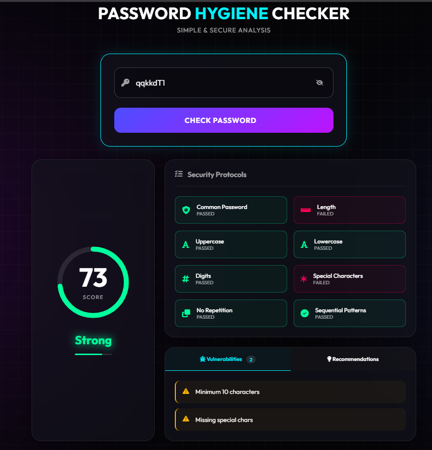
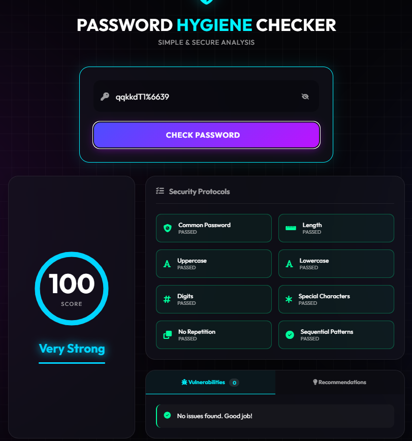

## Testing

Starting with the very common "password" -- Failing common password test gives absolutely zero

Adding Uppercase still zero for common password

Lowercase + Uppercase with number

Adding special characters

Passing all test
